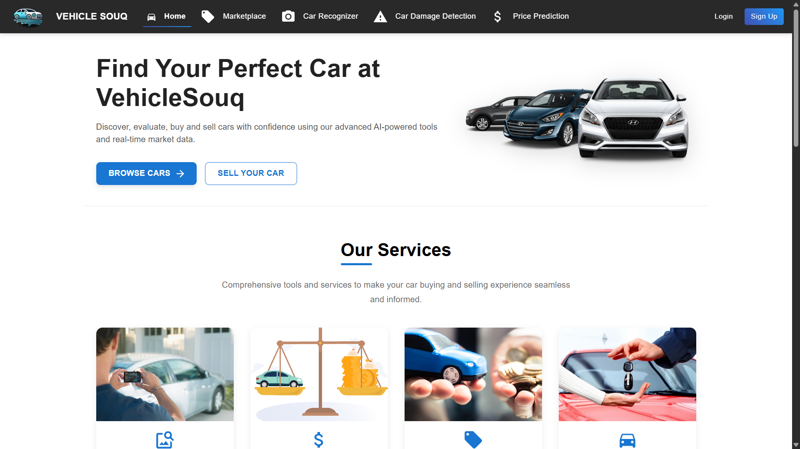

# Vehicle Souq: Car Recognition & Price Prediction System

<!-- Demo Preview -->
<p align="center">
  <a href="https://drive.google.com/file/d/102w9s_smjmn74-Jam3dtPNFl5tok_9UA/view?usp=sharing" target="_blank">
    
  </a>
  <br />
  <sub>Click the image to watch the full demo video</sub>
</p>

<!-- Project Demo -->
<p align="center">
  <a href="https://drive.google.com/file/d/102w9s_smjmn74-Jam3dtPNFl5tok_9UA/view?usp=sharing" target="_blank">
    
  </a>
</p>
<p align="center">
  <sub>If the badge does not open, use this link: https://drive.google.com/file/d/102w9s_smjmn74-Jam3dtPNFl5tok_9UA/view</sub>
</p>

<p align="center">
  
</p>

## 📌 Overview

Vehicle Souq addresses critical challenges in Egypt's used car market, where inflation and inconsistent pricing practices make it difficult for buyers and sellers to determine fair vehicle values. Our AI-powered system combines advanced image recognition with precise price prediction to bring transparency and reliability to the market.

This project is based on extensive research conducted by Mostafa Hisham, Hisham Ahmed, and Dr. Mohamed Labib from MSA University, Egypt. Our methodology combines computer vision with machine learning to deliver accurate car identification and pricing, even for users with limited automotive knowledge.

## 🔍 The Problem

Egypt's used car market faces several challenges:
- Price inconsistencies due to inflation and market volatility
- Sellers often list cars at artificially high or low prices
- Buyers struggle to determine fair market values
- Traditional pricing methods require detailed car specifications that buyers may not know

## 💡 Our Solution

Vehicle Souq provides a comprehensive platform that:
- Identifies car make, model, and year from images with 94.41% accuracy
- Predicts fair market prices with 97% accuracy based on real market data
- Simplifies the car buying/selling process through automation
- Allows users to list their vehicles or find suitable cars to purchase
- Provides a data scraping and visualization system for market analysis

## 🚀 Key Features

### For Buyers
- **AI-Powered Image Recognition**: Simply upload a car photo to identify make, model, and year
- **Accurate Price Predictions**: Get fair market value estimates based on 23,421 real listings
- **Automated Data Entry**: Car specifications automatically populated after image recognition
- **Comprehensive Car Details**: Access detailed specifications for identified vehicles
- **Simplified Experience**: No need for expert car knowledge to get accurate information

### For Sellers
- **Market-Informed Pricing**: List vehicles at competitive, data-driven prices
- **Listing Management**: Create and manage vehicle listings with comprehensive details
- **Image Gallery Support**: Upload multiple images to showcase your vehicle
- **Reach Potential Buyers**: Connect with users looking for vehicles matching your listing

### For Administrators
- **Data Scraping System**: Collect real-time market data from online sources
- **Visual Analytics**: Analyze market trends, pricing patterns, and popular models
- **Database Management**: Maintain and update the system's knowledge base

## 📊 Performance Metrics

### Price Prediction Models Performance on Dubizzle Dataset
| Model | RMSE | R² | MAE |
|------------|-----------|-------------|---------|
| Linear Regression | 1,046,089.89 | 0.41 | 643,654.09 |
| Random Forest | 263,776.37 | 0.96 | 108,516.94 |
| Gradient Boosting | 567,266.56 | 0.83 | 299,055.29 |
| K-Neighbors | 687,020.43 | 0.75 | 314,268.92 |
| **XGBoost** | **238,856.53** | **0.97** | **122,388.85** |

### Vehicle Recognition Performance Comparison
| Model | Accuracy (%) | Precision | Recall | F1-Score |
|------------|-----------|-------------|---------|---------|
| **DenseNet201** | **94.41** | **0.9485** | **0.9441** | **0.9439** |
| ResNet152 | 93.02 | 0.9362 | 0.9302 | 0.9299 |
| ResNet50 | 82.74 | 0.8274 | 0.8241 | 0.8233 |

## 🧠 Technology Stack

### Machine Learning & AI
- **Image Recognition**: DenseNet201 (transfer learning from ImageNet)
- **Price Prediction**: XGBoost regression model
- **Object Detection**: YOLOv5 for initial car detection in images
- **Data Analysis**: Pandas, NumPy, Scikit-learn for preprocessing and evaluation

### Web Application
- **Frontend**: React.js with Material UI for responsive design
- **Backend**: FastAPI (Python) for high-performance API endpoints
- **Database**: JSON files for car specifications, file-based storage for models

## 📂 Project Structure

```
VehicleSouq/
├── backend/                    # FastAPI server
│   ├── dataset/                # Car specifications data
│   ├── models/                 # ML models
│   ├── routes/                 # API endpoints
│   ├── uploads/                # Uploaded car images
│   ├── utils/                  # Helper utilities
│   └── main.py                 # Server entry point
├── frontend/                   # React application
│   ├── public/                 # Static assets
│   └── src/
│       ├── components/         # React components
│       ├── context/            # Context providers
│       ├── pages/              # Application pages
│       └── App.js              # Main component
└── README.md                   # Project documentation
```

## 📊 Datasets

Our system is built on three primary datasets:

### 1. Dubizzle Dataset
- **Source**: Web-scraped from Dubizzle platform
- **Size**: 23,421 used car listings
- **Features**: Make, model, body type, color, price, kilometers, year, fuel type, transmission type, engine capacity (CC), location, lister type
- **Usage**: Primary dataset for price prediction models

### 2. CarDekho Dataset
- **Source**: Kaggle
- **Features**: Car name, year, selling price, present price, kilometers driven, fuel type, seller type, transmission, owner history
- **Usage**: Initial testing and validation of price prediction models

### 3. Stanford Cars Dataset
- **Size**: 16,186 images across 196 classes
- **Features**: High-quality images categorized by make, model, and year
- **Usage**: Training and testing the image recognition model

## 🛠️ Installation & Setup

### Prerequisites
- Python 3.8+
- Node.js 14+
- npm or yarn

### Backend Setup
```bash
# Clone the repository
git clone https://github.com/Mostafa-Hesham1/Graduation-project.git
cd vehicle-souq

# Create a virtual environment
python -m venv venv
source venv/bin/activate  # On Windows: venv\Scripts\activate

# Install dependencies
cd backend
pip install -r requirements.txt

# Start the server
python main.py
```

### Frontend Setup
```bash
# Navigate to frontend directory
cd frontend

# Install dependencies
npm install

# Start the development server
npm start
```

## 🚗 How It Works

### 1. Image Recognition Process
1. User uploads a car image
2. YOLO detector confirms the presence of a car
3. DenseNet201 model identifies make, model, body type, and year
4. System retrieves detailed specifications for the identified vehicle

### 2. Price Prediction Flow
1. System uses identified car details or manual user input
2. XGBoost algorithm processes the input features
3. Model calculates estimated market price based on training from 23,421 listings
4. Price is presented to the user with confidence indicators

### 3. Data Scraping System
1. Administrator accesses the scraping interface
2. System collects data from specified online sources
3. Data is processed, cleaned, and stored in the database
4. Visual analytics show market trends and patterns

## 📱 Usage

### Image Upload & Recognition
1. Upload an image of a car you're interested in
2. The system will automatically identify the car's make, model, and year
3. View detailed specifications of the identified vehicle

### Price Prediction
1. After car identification (or manual data entry)
2. Enter additional information like mileage and condition
3. Get an accurate price estimate based on current market data

### Car Listings
1. Create detailed listings with images and specifications
2. Browse listings from other sellers
3. Filter and search based on your preferences

### Admin Data Visualization
1. Access the admin dashboard
2. Initiate data scraping for fresh market information
3. View analytics on price distributions, popular models, and market trends

## 🌟 Advantages Over Existing Solutions

- **Combined Approach**: Uniquely integrates image recognition with price prediction
- **High Accuracy**: 94.41% recognition accuracy and 97% price prediction accuracy
- **User-Friendly**: Requires minimal car knowledge from users
- **Data-Driven**: Based on extensive real-world market data
- **Regularly Updated**: System can be continuously updated with new market data
- **Market-Specific**: Tailored to the unique challenges of the Egyptian used car market

## 🧪 Methodology

### Data Preprocessing
- **Dubizzle Dataset**: Cleaned unstructured text, encoded categorical features, handled missing values
- **CarDekho Dataset**: Extracted features from text descriptions, validated data quality
- **Stanford Cars Dataset**: Standardized images, implemented augmentation pipeline

### Model Training
- **Price Prediction**: 10-fold cross-validation, feature scaling, L2 regularization
- **Image Recognition**: Transfer learning, custom classification head, dropout regularization

### Evaluation Metrics
- **Regression Models**: Mean Squared Error (MSE), R², Mean Absolute Error (MAE)
- **Classification Models**: Accuracy, Precision, Recall, F1-Score


## 📚 Citation

```

```

## 📄 License

This project is licensed under the MIT License - see the LICENSE file for details.
